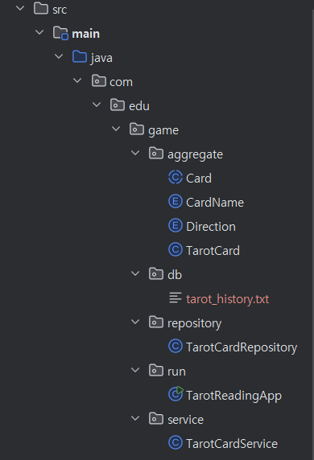

## 👥 팀원
- [남가람](https://github.com/catnine11)

# 🔮 타로 리딩 앱

**타로 리딩 앱**에 오신 것을 환영합니다! 이 Java 애플리케이션을 통해 간단한 타로 카드 리딩으로 미래를 탐색할 수 있습니다. 오늘의 운세, 연애운, 금전운 등 다양한 주제에 대한 궁금증을 해소하세요.(이후 기능 확장 희망)

## 📋 주요 기능

- **랜덤 타로 카드 선택**: 메이저 아르카나에서 카드를 선택하고, 선택한 주제에 따른 해석을 제공합니다.
- **오늘의 운세, 연애운, 금전운 리딩**: 원하는 주제를 선택하여 리딩을 받을 수 있습니다.
- **방향에 따른 해석**: 카드가 정방향 또는 역방향에 따라 다른 의미를 제공합니다.
- **히스토리 기록**: 리딩 결과를 텍스트 파일에 저장하여 나중에 참고할 수 있습니다.

## 🎮 사용 방법

1. **앱 실행**: run ~.main()의 명령어를 통해 애플리케이션을 실행합니다.
2. **질문 선택**: 오늘의 운세, 연애운, 금전운 중 하나를 선택합니다.
3. **카드 선택**: 질문을 생각하며 1에서 22 사이의 숫자를 선택합니다.
4. **해석 읽기**: 선택한 주제와 카드의 방향에 따른 해석을 제공합니다.
5. **결과 저장**: 결과는 `tarot_history.txt` 파일에 저장되어 나중에 다시 확인할 수 있습니다.
6. **계속하거나 종료**: 리딩 후 계속 진행하거나 애플리케이션을 종료할 수 있습니다.

## 📂 프로젝트 구조

```plaintext
