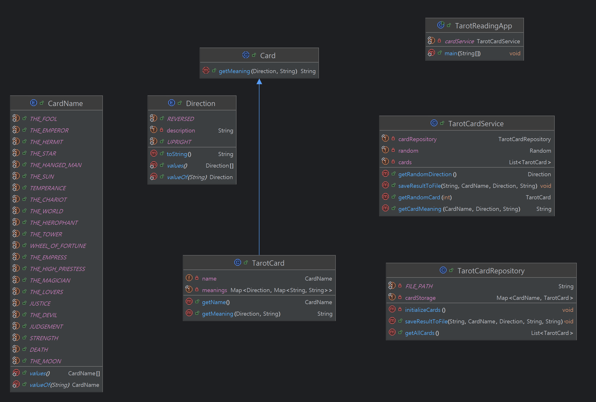

## 👥 개발자
<table>
  <tr>
      <a href="https://github.com/catnine11">
        
         
        <b>남가람</b>
      </a>
  </tr>
</table>

----
# 🔮 타로 리딩 앱

**타로 리딩 앱**에 오신 것을 환영합니다! 이 Java 애플리케이션을 통해 간단한 타로 카드 리딩으로 미래를 탐색할 수 있습니다. 오늘의 운세, 연애운, 금전운 등 다양한 주제에 대한 궁금증을 해소하세요.(이후 기능 확장 희망)

----
## 📋 주요 기능

- **랜덤 타로 카드 선택**: 메이저 아르카나에서 카드를 선택하고, 선택한 주제에 따른 해석을 제공합니다.
- **오늘의 운세, 연애운, 금전운 리딩**: 원하는 주제를 선택하여 리딩을 받을 수 있습니다.
- **방향에 따른 해석**: 카드의 정방향 또는 역방향에 따라 다른 의미를 제공합니다.
- **히스토리 기록**: 리딩 결과를 텍스트 파일에 저장하여 나중에 확인할 수 있습니다.

----
## 🎮 사용 방법

1. **앱 실행**: run TarotReadingApp.main()의 명령어를 통해 애플리케이션을 실행합니다.
2. **질문 선택**: 오늘의 운세, 연애운, 금전운 중 하나를 선택합니다.
3. **카드 선택**: 질문을 생각하며 1에서 22 사이의 숫자를 선택합니다.
4. **해석 읽기**: 선택한 주제와 카드의 방향에 따른 해석을 제공합니다.
5. **결과 저장**: 결과는 `tarot_history.txt` 파일에 저장되어 나중에 다시 확인할 수 있습니다.
6. **계속하거나 종료**: 리딩 후 계속 진행해 다른 운세를 추가로 보거나 애플리케이션을 종료할 수 있습니다.

----
## 📊 클래스 다이어그램

 

----
## 📂 프로젝트 구조
 

📂 src/main/java/com/edu/game

🔹 aggregate 패키지

- **Card**  
  카드 객체를 정의하는 클래스입니다. 모든 카드의 공통 속성과 동작을 정의합니다.

- **CardName**  
  카드를 식별하는 데 사용되는 카드 이름을 정의합니다. 각 타로 카드의 이름을 열거형(enum)으로 관리합니다.

- **Direction**  
  카드의 방향을 열거형(enum)으로 관리하는 클래스입니다. 카드를 정방향 또는 역방향으로 해석할 수 있도록 합니다.

- **TarotCard**  
  타로 카드에 특화된 클래스입니다. Card 클래스를 상속하며, 각 타로 카드의 방향에 따른 의미를 나타내줍니다.

🔹 db 패키지

- **tarot_history.txt**  
  타로 카드 리딩 기록이 저장되는 파일입니다. 사용자의 과거 리딩 기록을 조회할 수 있는 데이터를 포함합니다.

🔹 repository 패키지

- **TarotCardRepository**  
  파일에서 타로 카드 데이터를 불러오고 저장하는 기능을 담당하는 클래스입니다. 주로 tarot_history.txt 파일과 상호작용합니다.
 각 카드의 키워드와 방향별 의미를 저장합니다.

🔹 run 패키지

- **TarotReadingApp**  
  애플리케이션의 진입점 클래스입니다. 프로그램을 실행하고 타로 리딩 프로세스를 시작합니다.

🔹 service 패키지

- **TarotCardService**  
  타로 카드 리딩의 비즈니스 로직을 담당하는 클래스입니다. 카드 읽기, 카드 섞기, 기록 관리 등 주요 기능이 구현되어 있습니다.

## 📌 주요코드

 타로카드 의미

 타로카드 초기화(카드 생성) 

 서비스 

 파일 저장 

## 🎬 시연영상

